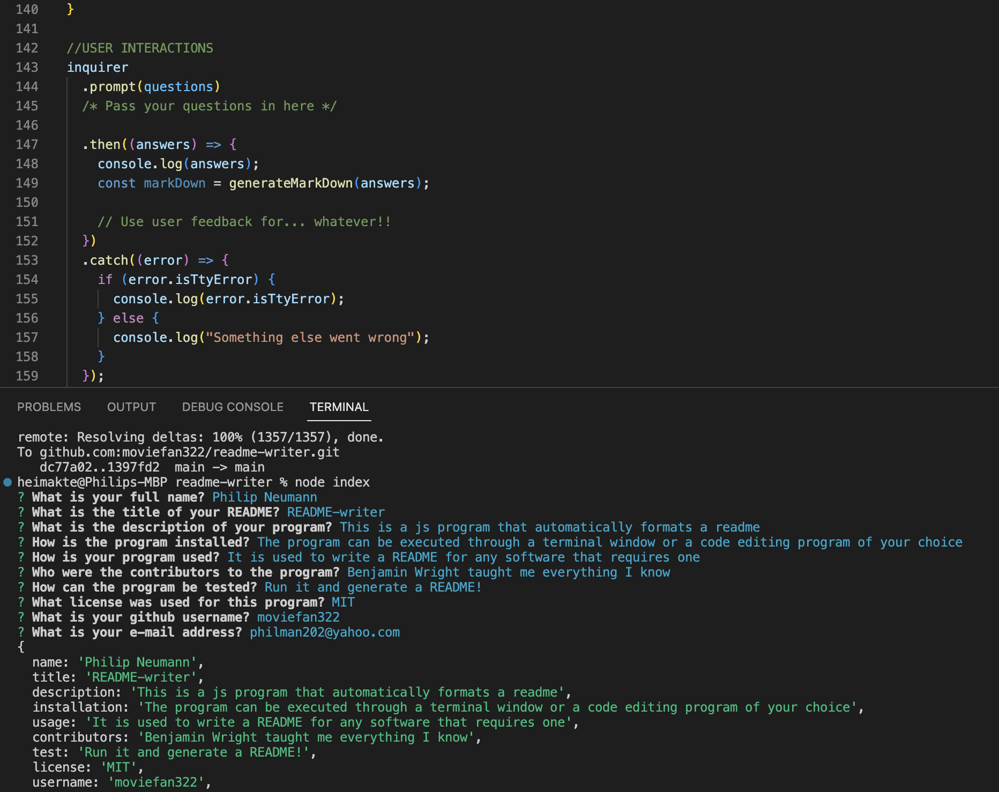

# README-writer 

## Table of Contents

### [Description](#Description)
### [Installation](#Installation)
### [Usage](#Usage)
### [Testing](#Testing)
### [Contributors](#Contributors)
### [License](#License)
### [Contact](#Contact)

## Description
    
This is a js program that automatically formats a readme
    
## Installation
    
The program can be executed through a terminal window or a code editing program of your choice

## Usage
    
It is used to write a README for any software that requires one    

 
## Testing

Run it and generate a README!

## Contributors
    
Benjamin Wright taught me everything I know

## License
    
This is a js program that automatically formats a readme

## Contact

Philip Neumann
https://github.com/moviefan322
philman202@yahoo.com
    